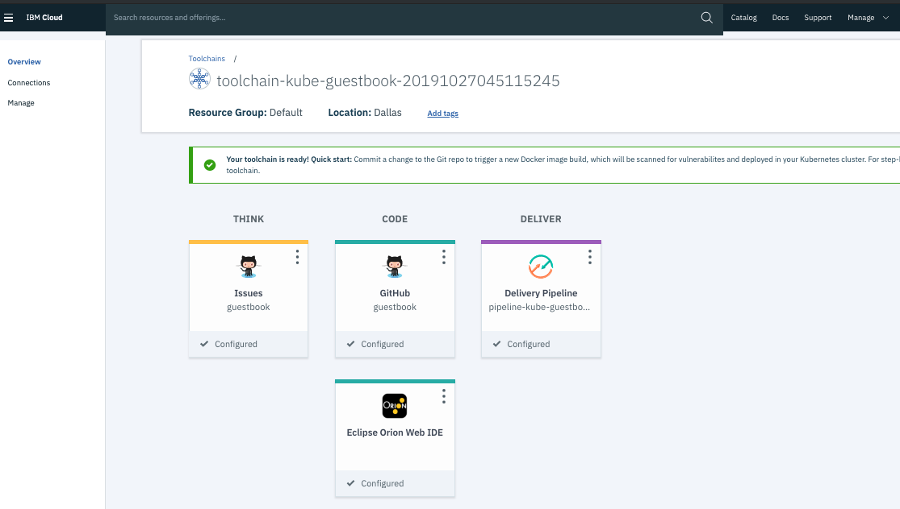

# Toolchain 1 - Deploy a Kubernetes App

In many of the naming, you need a name globally unique on the IBM Cloud. IBM Cloud will generate a default name with a timestamp part that you can re-use, but if you want or need your own, create a timestamp from bash commandline with `$ date +%s`,

	```console
	$ date +%s
	1571778717
	```

1. Create a Toolchain,
    * Login to your IBM Cloud account,
    * Go to https://cloud.ibm.com/devops/toolchains
    * Click the `Create a Toolchain`,

		

    * Select the `Develop a Kubernetes app` template,

		
    
	* This will start the create toolchain process,

2. Configure the Toolchain, preserve the unique timestamp part where possible, and configure for:

    * Toolchain Name: `toolchain-kube-guestbook-<timestamp>`
        * Use the existing appended timestamp of the generated name,
    * Select Region: <default>, 
      * Note: if you have an existing `Continuous Delivery` service, make sure that the region matches with the region of your `Continuous Delivery` service,
    * Select a resource group: `Default`
    * Select a source provider: `Github`,
        * This will reload the page with a Github configuration section,
        * If asked for Authorization, `Authorize` the toolchain,
        * Github Server: `https://github.com`,
        * Repository Type: `Existing`,
        * Source repository URL: here you can choose to use the IBM repo `https://github.com/IBM/guestbook` or a fork of the IBM repo to your personal account, i.e. `https://github.com/<username>/guestbook`. If you use the fork you will have admin access and this lets you use the Issues support. If you use the public IBM repo you cannot use Issues support in your toolchain. 
        * If you choose your personal Github account, you should be able to select the drop down and scroll to find your fork of the `guestbook` repo,
        * If you choose the public IBM repo instead:
          * Uncheck `Enable GitHub Issues`,
          * Uncheck `Track deployment of code changes`, 
    * Click `Create` button,
    * You will be taken to the next step: the Delivery Pipeline,

3. Configure the `Delivery Pipeline`:
    
    * Define the following settings:
        * App name: `guestbook-<username>-<timestamp>`,
        * IBM Cloud API Key:
            * If you have an existing IBM Cloud API Key, copy-paste the API Key,
            * If you do not have an existing IBM Cloud API Key,
                * Click the `Create` button to generate a new one,
                * Or go to `Manage` > `Access (IAM)` > `IBM Cloud API Keys` to create a new IBM Cloud API Key,
                * copy-paste the API Key,
                * Click the Create button to confirm,
                * This should trigger the validation of the API Key, and if validated, should autoload values for `Container registry region`, `Container registry namespace`,
                * Change the 'Container registry namespace' to the generated name for the 'App name' in the same page, but remove enough numbers from the timestamp to validate the name,
                    * This `Container registry namespace` must be unique for us.icr.io, you can also use the timestamp from above,
                * Change the following settings to match your region, resource group, and IKS Cluster Name settings that were assigned to you:
                  * `Cluster region`, e.g. wdc04 or dal10 (check) 
                  * `Resource Group`, e.g. 'workshop-nov2019'
                  * `Cluster name` make sure to select the correct cluster, 
                  * Set `guestbook-ns` for `Cluster namespace`,
    * Click the `Create` button,

		

    * The Toolchain is being configured,
    * When the Toolchain has successfully been configured, you will see the Tools in the Toolchain: THINK (if you selected Issues Management), CODE, DELIVER, and Eclipse Orion Web IDE,
    * Click the top right drop down of the `kube-toolchain-123456...` and select `Rename`,
    * Rename the toolchain name to `toolchain-kube-guestbook-<timestamp>`,
    * In the DELIVER tool window, click the top right dropdown and select `Configure`,

		

    * Change the `Pipeline name` to `pipeline-kube-guestbook-<timestamp>`,
    * Click `Save Integration`,
    * Go back to the `Overview` page,

		

4. Review and Debug the Toolchain Configuration,
    * The `CODE` window should link to your source code repository,
    * The `Eclipse Orion Web IDE` should link to an online Eclipse code editor,
    * Click the `DELIVER` window to review the `Delivery Pipeline`,
        * The `Delivery Pipeline` page will load,

		* If you selected to integrate the Github Issues on a new Github repository, the build event will trigger automatically,
        * For the original Github repository of existing code without Github Issues, click the play icon in the `BUILD` stage to kick off the build,
            * The initial `BUILD` stage passes,
            * In the `JOBS` section, click the `View logs and history` link,
            * The `BUILD` stage fetched the source code and tried running the unit tests. The test runner script was not found but the tests did not result in failed tests. (Note: this should fail however)
            * Return to the `guestbook-delivery-pipeline`,

        * The `CONTAINERIZE` stage failed,
            * In the `JOBS` section, click the `View logs and history` link,
            * Review the build logs, and note that the `Dockerfile` was not found,
            * Also in the build logs, note the environment variables that were configured

                ```
                DOCKER_ROOT=.
				DOCKER_FILE=Dockerfile
				build.properties:
				GIT_URL=https://github.com/<username>/guestbook.git
				GIT_BRANCH=master
				GIT_COMMIT=5246a420041424130f32d292cca7fc7a99aa0b93
				SOURCE_BUILD_NUMBER=1
                ```

            * The Dockerfile for the guestbook application is located in the `v1/guestbook` and `v2/guestbook` subdirectories, so the reference needs to be set to include the relative path,
            * Go back to the `Delivery Pipeline` page, in the `CONTAINERIZE` window, from the settings drop down, click the `Configure Stage` icon,
            * In the `Jobs` tab, note there are 4 jobs belonging to the stage, each job corresponds to a step in the `Build logs`,
            * Review the `Check dockerfile` job. Note that this is essentially a Bash script that runs the script located at `https://raw.githubusercontent.com/open-toolchain/commons/master/scripts/check_dockerfile.sh`,
            * If you review the bash script, it sets the `DOCKER_ROOT` environment variable to the current directory if not set, and this is the reason that our Dockerfile is not found, 
            * Go to the `Environment properties` tab of the `CONTAINERIZE` stage, 
            * Change the `DOCKER_ROOT` property from `.` to `./v2/guestbook`,
            * Click `SAVE`

            * Manually trigger the `CONTAINERIZE` stage again by clicking the `Play` icon,
            * The `Check dockerfile` job in the `CONTAINERIZE` stage should pass now,
            * If any of the next jobs fails, review the `View logs and history` link, and select the failed job, to debug,
            * Go to https://cloud.ibm.com/kubernetes/clusters, go to `Registry` and `Images`,
            * You should see now that your `guestbook` image added to your registry under the namespace you defined earlier, e.g. `guestbook-ns-<username>-<timestamp>`,
        
        * Review the `DEPLOY` stage,
            * You should see that the stage passed successfully,
            * If the stage failed, review the `View logs and history` link to debug the stage,
            * Your deployment to Kubernetes of the deployment resource should succeed and the health check should pass successfully,
        
5. Check your Kubernetes cluster, in the `guestbook-ns` namespace, you should see your deployment running, 

6. Login to IBM Cloud

	```console
	$ ibmcloud login -u $IBM_USERID -p $IBM_PASSWORD -r $REGION -g $IBM_RG -c $ACCOUNTID
	$ ibmcloud target --cf-api $IBM_CFAPI
	```

7. Connect to your cluster

	```console
	$ ibmcloud ks cluster config --cluster $CLUSTER_NAME
	$ export KUBECONFIG="/root/.bluemix/plugins/container-service/clusters/${CLUSTER_NAME}/kube-config-${ZONE}-${CLUSTER_NAME}.yml"
	$ kubectl config current-context
	$ kubectl get namespaces
	```
