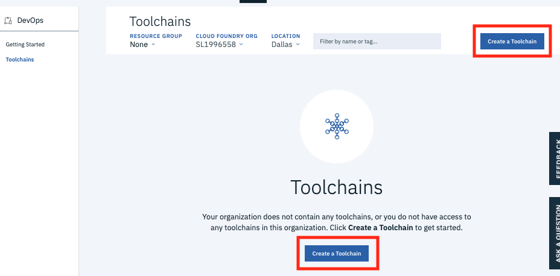
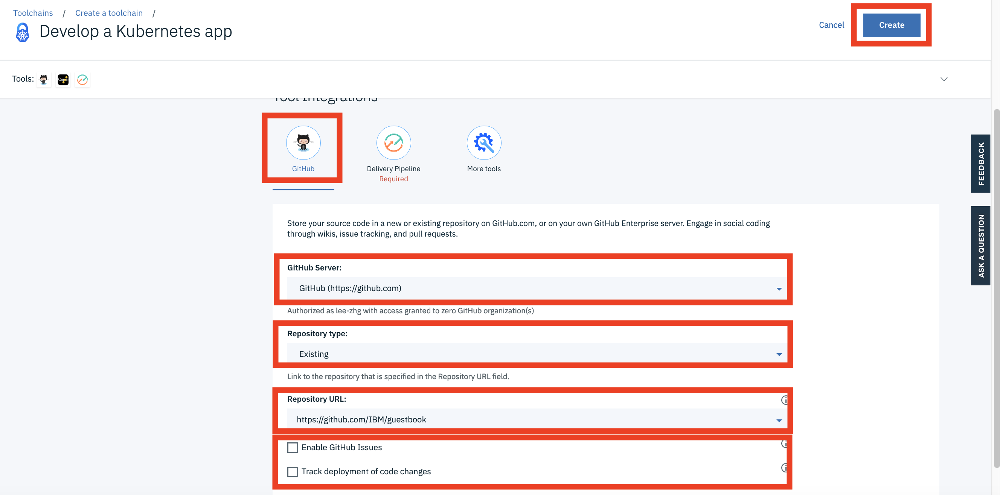
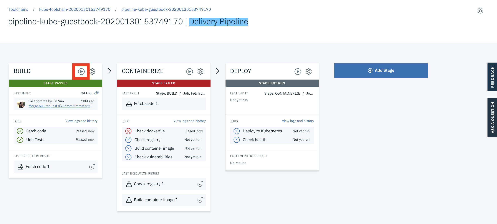
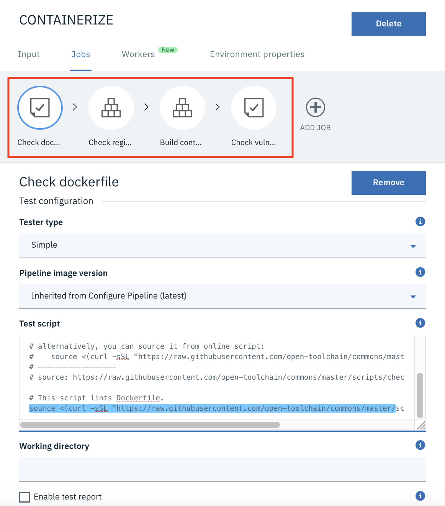
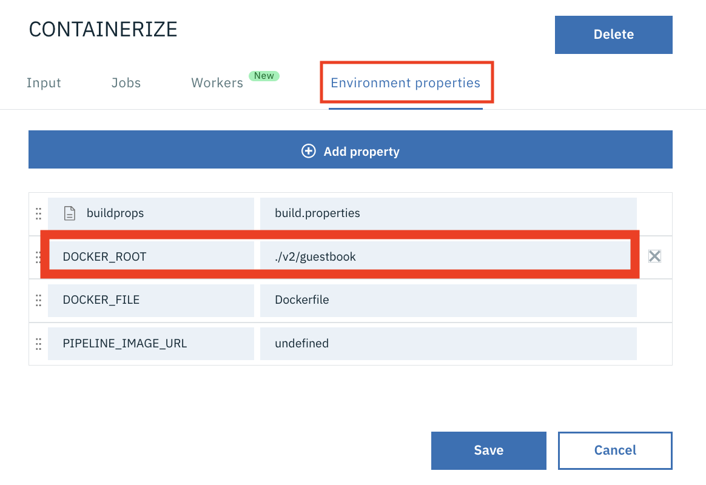
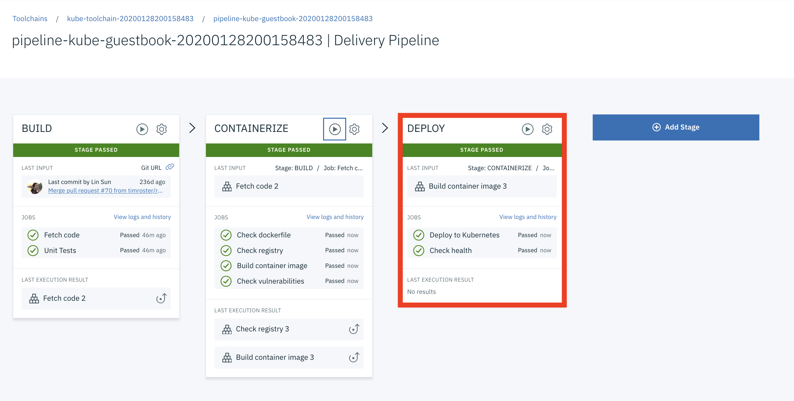
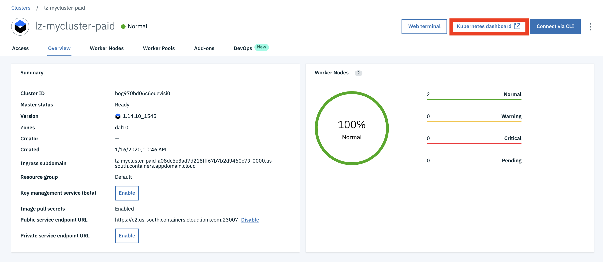
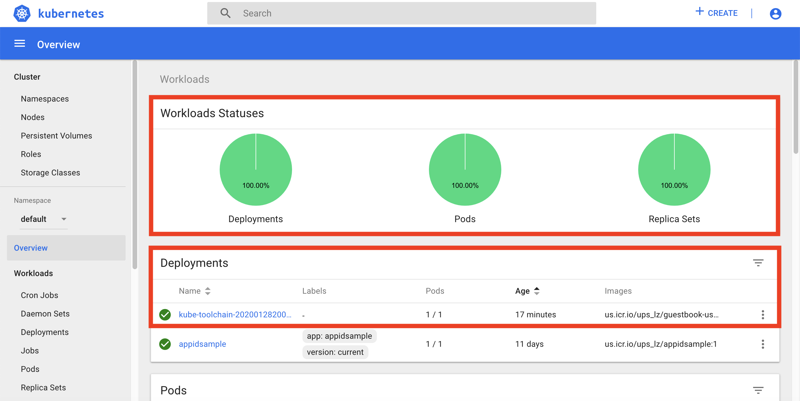

# DevOps Lab 1 - Deploy a Sample Application to Kubernetes Kubernetes Cluster in IBM Cloud

In this lab, you are going to create a toolchain and automate the deployment of a sample application to Kubernetes cluster in IBM Cloud.


## Create a Toolchain

To create a `Toolchain` in IBM Cloud environment,

1. Login to your IBM Cloud account at https://cloud.ibm.com

1. Navigate to https://cloud.ibm.com/devops/toolchains

1. Click the `Create a Toolchain`,

	
    
1. Select the `Develop a Kubernetes app` template,

	
    
1. This starts the create toolchain process.    

    


## Configure the Toolchain

The name of toolchain and its components includes a timestamp. It's recommend to preserve the unique timestamp part of service names where possible while configuring the toolchain.

To configure your `Toolchain`   ,

1. Rename the Toolchain to `toolchain-kube-guestbook-<timestamp>`. Keep the existing timestamp of the original toolchain name.

1. Change the `Region` to `Washington DC` or your preferred region.

    > Note: if you have an existing `Continuous Delivery` service, make sure that the region matches with the region of your `Continuous Delivery` service,

1. Change the `resource group` to `Feb2020Workshop` or your preferred resource group.

1. Select `GitHub` as the source provider. This will reload the page with a Github configuration selection.

1. Click `Authorize` to login to `GitHub`.

1. Enter `GitHub (https://github.com)` in the `Github Server` field.

1. Select `Existing` as the Repository Type.

1. Enter `https://github.com/IBM/guestbook` as the `Repository URL`. 

    > Note: If you forked the repo while preparing the lab environment, you can also use the URL of your forked repo in your personal Github account, i.e. `https://github.com/<username>/guestbook`. 

    > Note: If you use the forked repo, you will have admin access and this lets you have the `Issues` support. If you use the public IBM repo, you don't have `Issues` support in your toolchain. 

    > Note: If you choose your personal Github account, you should be able to select the drop down and scroll to find your fork of the `guestbook` repo.

1. If you choose to use the public IBM repo `https://github.com/IBM/guestbook`, 
    * Uncheck `Enable GitHub Issues`.
    * Uncheck `Track deployment of code changes`.

    

1. Click `Create` button. You will be taken to the next step: the Delivery Pipeline,


## Configure the Delivery Pipeline

The name of toolchain and its components includes a timestamp. It's recommend to preserve the unique timestamp part of service names where possible while configuring the toolchain.

To configure the `Delivery Pipeline` in your `Toolchain`,

1. Rename `App name` to `guestbook-<username>-<timestamp>`.

2. Click the `New` button in the `IBM Cloud API key` section to generate a new API key.

> Note: If you have an existing IBM Cloud API Key, you can reuse it by copy-paste the API Key.

3. Click OK when prompted.

4. This autoloads values for `Container registry region`, `Container registry namespace`.

5. Review the `Container registry region`.

6. Change the `Container registry namespace` to the one that you created earlier. The command below should retrieve your registry name space.

    ```
    echo $CRNAMESPACE
    ```

> Note, The `Container registry namespace` must be unique for us.icr.io, you can also use the timestamp if necessary.

7. Review the `Cluster region`. It is typically `Dallas` or `Washington DC`. But, it deponds on your Kubernetes cluster location.

8. The `Resource Group` should be set to 'Default` unless your instructors provide different instructions.

9. Select the correct `Cluster name`.

10. Set `Cluster namespace` to `default` unless your instructors provide different instructions.

	

11. Click the `Create` button. The Toolchain and its compoenents are being configured.

12. After the Toolchain configuration is successfully completed, you will see the `Tools` in the `Toolchain`: 
    * `THINK (only available if you chose to use your forked repo and selected `Issues Management`)
    * `CODE`
    * `DELIVER`
    * `Eclipse Orion Web IDE`

    

13. Within the `DELIVER` tile, click the top-right dropdown(3 vertical dots) and select `Configure`. This bring you to the `Delivery Pipeline` window.

	

14. Rename the `Pipeline name` to `pipeline-kube-guestbook-<timestamp>`.

15. Click `Save Integration`. This bring you back to the `Overview` page.


## Run and Debug the Toolchain

You run and debug the `Toolchain` in the section.

1. The `CODE` tile links to your source code repository at github.com.

2. The `Eclipse Orion Web IDE` tile links to an online Eclipse code editor.

3. Click the `DELIVER` tile to navigate to the `Delivery Pipeline` window.

	

4. Click the `play` icon within the `BUILD` tile to kick off the build process. You can observe the building progress within the `JOBS` section of the `BUILD` tile. 

5. Click the `View logs and history` link of the `JOBS` section to view detail information.
    * The `BUILD` stage fetched the source code and tried running the unit tests. The test runner script was not found but the tests did not result in failed tests. (Note: this should fail however)

6. Return to the `pipeline-kube-guestbook-XXXXXX`.

7. Notice that the `CONTAINERIZE` stage failed. It's the next stage after `BUILD`.

    

8. Click the `View logs and history` link in the `JOBS` section of the `CONTAINERIZE` tile.

9. Review the build logs, and note that the `Dockerfile` was not found.

    ```
    Preparing to start the job...
    Pipeline image: latest
    Preparing the build artifacts...
    Pulling pipeline base image latest ...
    DOCKER_ROOT=.
    DOCKER_FILE=Dockerfile
    build.properties:
    GIT_URL=https://github.com/IBM/guestbook.git
    GIT_BRANCH=master
    GIT_COMMIT=5246a420041424130f32d292cca7fc7a99aa0b93
    SOURCE_BUILD_NUMBER=2
    ==========================================================
    Checking for Dockerfile at the repository root
    Dockerfile not found at: Dockerfile

    Finished: FAILED
    ```

    > Note: The Dockerfile for the guestbook application is located in the `v1/guestbook` and `v2/guestbook` subdirectories, so the reference needs to be set to include the relative path.

10. Return to the `pipeline-kube-guestbook-XXXXXX`.

11. Within the `CONTAINERIZE` tile, click the `settings` icon on the top-right and select the `Configure Stage`.

12. In the `Jobs` tab, note there are 4 jobs belonging to the stage, each job corresponds to a step in the `Build logs`.

    

13. Review the `Check dockerfile` job. This is essentially a Bash job that runs the script located at `https://raw.githubusercontent.com/open-toolchain/commons/master/scripts/check_dockerfile.sh`.

14. If you review the bash script, it sets the `DOCKER_ROOT` environment variable to the current directory when it's not set. This is the reason that our Dockerfile is not found.

    ```
    echo "=========================================================="
    echo "Checking for Dockerfile at the repository root"
    if [ -z "${DOCKER_ROOT}" ]; then DOCKER_ROOT=. ; fi
    if [ -z "${DOCKER_FILE}" ]; then DOCKER_FILE=Dockerfile ; fi
    ```

15. Move to the `Environment properties` tab of the `CONTAINERIZE` stage.

16. Change the `DOCKER_ROOT` variable from `.` to `./v2/guestbook`.

    

17. Click `Save`.

18. Manually start the `CONTAINERIZE` stage again by clicking the `Play` icon. The `Check dockerfile` job in the `CONTAINERIZE` stage should pass now.

19. If any of the jobs failed, review and debug the problem by selecting the `View logs and history` link and select the failed job.

20. It can take a few minutes for the `CONTAINERIZE` stage to complete.

    

21. After the `CONTAINERIZE` stage completes, navigate to IKS dashboard https://cloud.ibm.com/kubernetes/clusters in a different browser tab.

22.  Select the `Registry` tab on the left.

23. Click the `Images`.

    

24. You should see that your `guestbook` image added to your registry under the namespace you defined earlier.
        
25. Return to the `pipeline-kube-guestbook-XXXXXX`.

26. Review the `DEPLOY` stage, you should see that the stage passed successfully. If it's still running (in blue color), pause the lab until it completes.

    

> Note: If the stage failed, review the `View logs and history` link to debug the stage.

27. Navigate to IKS dashboard https://cloud.ibm.com/kubernetes/clusters in a new browser tab.

28. Select your Kubernetes cluster this time.

    

29. Click the `Kubernetes dashboard` button on the top.

30. Your deployment to Kubernetes of the deployment resource should succeed and the health check should pass successfully.

    


## Verify your deployment to Kubernetes Cluster via CLI

You cab also verify successful deployment of CI/CD pipeline via Kubernetes CLI.

1. Go to your web terminal.

2. Verify that you are connecting to your Kubernetes cluster.

	```console
	$ kubectl config current-context
    ```

3. 	Verify that your Kubernetes pods are in `running` state.

	```console
	$ kubectl get pods

    NAME                                               READY   STATUS    RESTARTS   AGE
    kube-toolchain-20200128200158483-ff9c8d864-rncw6   1/1     Running   0          29m
    ```

4. Verify that your deployment are successful.

	```console
	$ kubectl get deployments

	NAME                               READY   UP-TO-DATE   AVAILABLE   AGE
    kube-toolchain-20200128200158483   1/1     1            1           24m
    ```


    s
