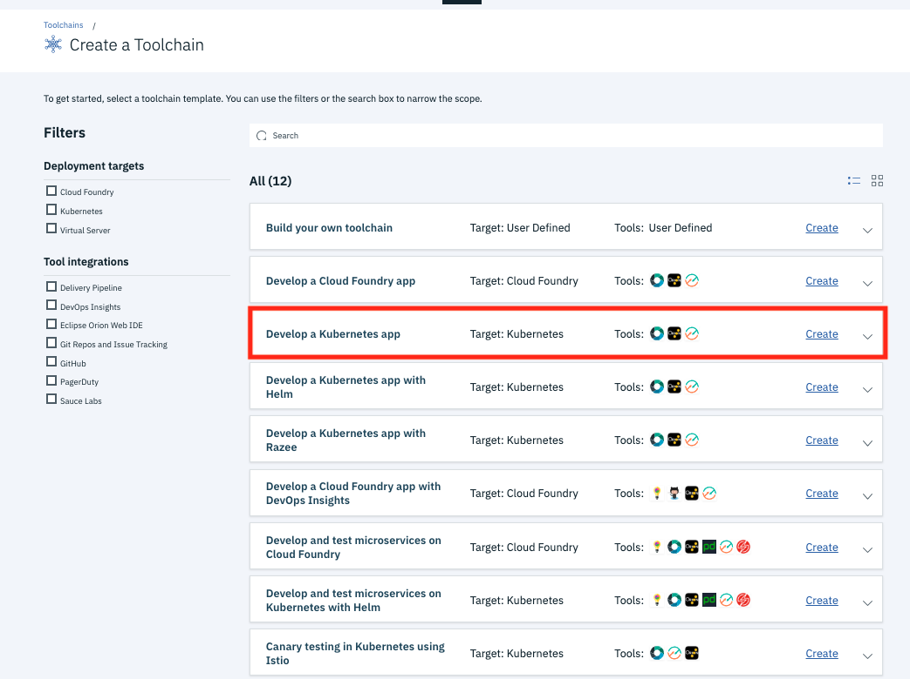
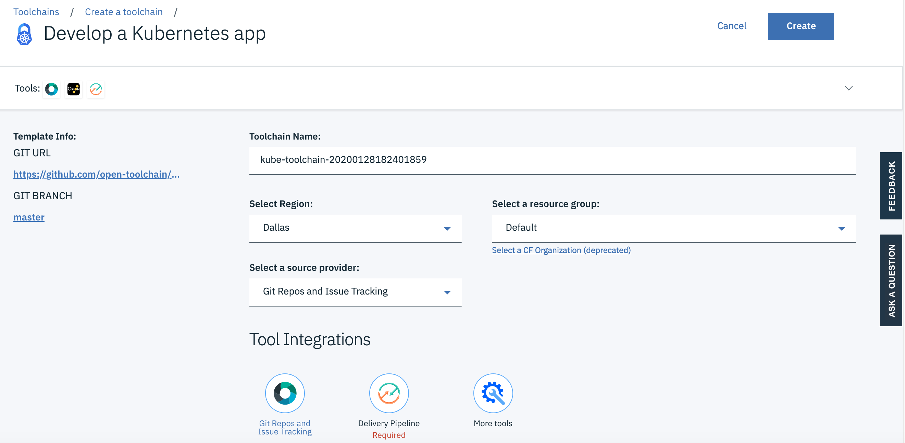
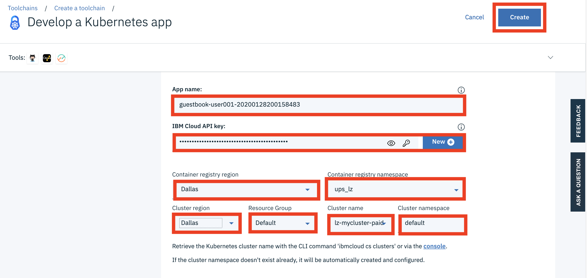

# Toolchain 1 - Deploy a Kubernetes App

In this lab, you are going to create a toolchain and automate the deployment of a sample application to Kubernetes cluster in IBM Cloud.


## Create a Toolchain

To complete a `Toolchain` in IBM Cloud environment,

1. Login to your IBM Cloud account at https://cloud.ibm.com

1. Navigate to https://cloud.ibm.com/devops/toolchains

1. Click the `Create a Toolchain`,

	
    
1. Select the `Develop a Kubernetes app` template,

	
    
1. This starts the create toolchain process.    

    


## Configure the Toolchain

It's recommend to preserve the unique timestamp part of service names where possible while configuring the toolchain.

To configure your `Toolchain`   ,

1. Rename the Toolchain to `toolchain-kube-guestbook-<timestamp>`. Keep the existing timestamp of the original toolchain name.

2. Change the `Region` to `Dallas` or your preferred region.

> Note: if you have an existing `Continuous Delivery` service, make sure that the region matches with the region of your `Continuous Delivery` service,

3. Change the `resource group` to `Default` or your preferred resource group.

4. Select `GitHub` as the source provider. This will reload the page with a Github configuration section.

5. Enter `GitHub (https://github.com)` in the `Github Server` field.

6. Select `Existing` as the Repository Type.

7. Enter `https://github.com/IBM/guestbook` as the `Repository URL`. 

> Note: If you forked the repo while preparing the lab environment, you can also use the URL of your forked repo in your personal Github account, i.e. `https://github.com/<username>/guestbook`. 

> Note: If you use the forked repo, you will have admin access and this lets you have the `Issues` support. If you use the public IBM repo, you don't have `Issues` support in your toolchain. 

> Note: If you choose your personal Github account, you should be able to select the drop down and scroll to find your fork of the `guestbook` repo.

8. If you choose to use the public IBM repo `https://github.com/IBM/guestbook`, 
    * Uncheck `Enable GitHub Issues`.
    * Uncheck `Track deployment of code changes`.

9. Click `Create` button. You will be taken to the next step: the Delivery Pipeline,


## Configure the `Delivery Pipeline`:

It's recommend to preserve the unique timestamp part of service names where possible while configuring the toolchain.

To configure the `Delivery Pipeline` in your `Toolchain`,

1. Rename `App name` to `guestbook-<username>-<timestamp>`.

2. Click the `New` button in the `IBM Cloud API key` section to generate a new API key.

> Note: If you have an existing IBM Cloud API Key, you can reuse it by copy-paste the API Key.

3. Click OK when prompted.

4. This autoloads values for `Container registry region`, `Container registry namespace`.

5. Review the `Container registry region`.

6. Change the `Container registry namespace` to the one that you created earlier. 

> Note, The `Container registry namespace` must be unique for us.icr.io, you can also use the timestamp if necessary.

7. Review the `Cluster region`. It is typically `Dallas` or `Washington DC`. But, it deponds on your Kubernetes cluster location.

8. The `Resource Group` should be set to 'Default` unless your instructors provide different instructions.

9. Select the correct `Cluster name`.

10. Set `Cluster namespace` to `default` unless your instructors provide different instructions.

11. Click the `Create` button. The Toolchain and its compoenents are being configured.

	

12. After the Toolchain configuration is successfully completed, you will see the `Tools` in the `Toolchain`: 
    * THINK (only available if you chose to use your forked repo and selected Issues Management)
    * CODE
    * DELIVER
    * Eclipse Orion Web IDE

    

13. In the `DELIVER` tile, click the top right dropdown(3 vertical dots) and select `Configure`. This bring you to the `Delivery Pipeline` window.

	

14. Rename the `Pipeline name` to `pipeline-kube-guestbook-<timestamp>`.

15. Click `Save Integration`. This bring you back to the `Overview` page.


## Review and Debug the Toolchain Configuration,
    * The `CODE` window should link to your source code repository,
    * The `Eclipse Orion Web IDE` should link to an online Eclipse code editor,
    * Click the `DELIVER` window to review the `Delivery Pipeline`,
        * The `Delivery Pipeline` page will load,

		* If you selected to integrate the Github Issues on a new Github repository, the build event will trigger automatically,
        * For the original Github repository of existing code without Github Issues, click the play icon in the `BUILD` stage to kick off the build,
            * The initial `BUILD` stage passes,
            * In the `JOBS` section, click the `View logs and history` link,
            * The `BUILD` stage fetched the source code and tried running the unit tests. The test runner script was not found but the tests did not result in failed tests. (Note: this should fail however)
            * Return to the `guestbook-delivery-pipeline`,

        * The `CONTAINERIZE` stage failed,
            * In the `JOBS` section, click the `View logs and history` link,
            * Review the build logs, and note that the `Dockerfile` was not found,
            * Also in the build logs, note the environment variables that were configured

                ```
                DOCKER_ROOT=.
				DOCKER_FILE=Dockerfile
				build.properties:
				GIT_URL=https://github.com/<username>/guestbook.git
				GIT_BRANCH=master
				GIT_COMMIT=5246a420041424130f32d292cca7fc7a99aa0b93
				SOURCE_BUILD_NUMBER=1
                ```

            * The Dockerfile for the guestbook application is located in the `v1/guestbook` and `v2/guestbook` subdirectories, so the reference needs to be set to include the relative path,
            * Go back to the `Delivery Pipeline` page, in the `CONTAINERIZE` window, from the settings drop down, click the `Configure Stage` icon,
            * In the `Jobs` tab, note there are 4 jobs belonging to the stage, each job corresponds to a step in the `Build logs`,
            * Review the `Check dockerfile` job. Note that this is essentially a Bash script that runs the script located at `https://raw.githubusercontent.com/open-toolchain/commons/master/scripts/check_dockerfile.sh`,
            * If you review the bash script, it sets the `DOCKER_ROOT` environment variable to the current directory if not set, and this is the reason that our Dockerfile is not found, 
            * Go to the `Environment properties` tab of the `CONTAINERIZE` stage, 
            * Change the `DOCKER_ROOT` property from `.` to `./v2/guestbook`,
            * Click `SAVE`

            * Manually trigger the `CONTAINERIZE` stage again by clicking the `Play` icon,
            * The `Check dockerfile` job in the `CONTAINERIZE` stage should pass now,
            * If any of the next jobs fails, review the `View logs and history` link, and select the failed job, to debug,
            * Go to https://cloud.ibm.com/kubernetes/clusters, go to `Registry` and `Images`,
            * You should see now that your `guestbook` image added to your registry under the namespace you defined earlier, e.g. `guestbook-ns-<username>-<timestamp>`,
        
        * Review the `DEPLOY` stage,
            * You should see that the stage passed successfully,
            * If the stage failed, review the `View logs and history` link to debug the stage,
            * Your deployment to Kubernetes of the deployment resource should succeed and the health check should pass successfully,
        
## Check your Kubernetes cluster, in the `guestbook-ns` namespace, you should see your deployment running, 

## Login to IBM Cloud

	```console
	$ ibmcloud login -u $IBM_USERID -p $IBM_PASSWORD -r $REGION -g $IBM_RG -c $ACCOUNTID
	$ ibmcloud target --cf-api $IBM_CFAPI
	```

## Connect to your cluster

	```console
	$ ibmcloud ks cluster config --cluster $CLUSTER_NAME
	$ export KUBECONFIG="/root/.bluemix/plugins/container-service/clusters/${CLUSTER_NAME}/kube-config-${ZONE}-${CLUSTER_NAME}.yml"
	$ kubectl config current-context
	$ kubectl get namespaces
	```
